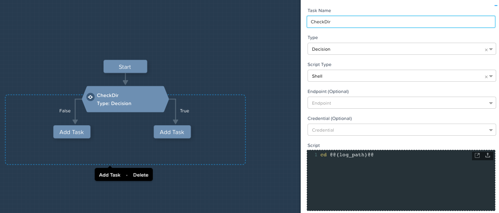
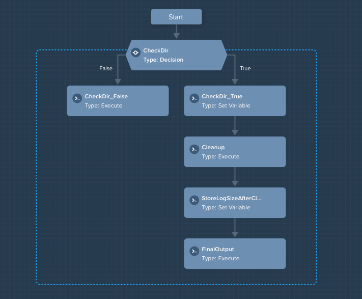
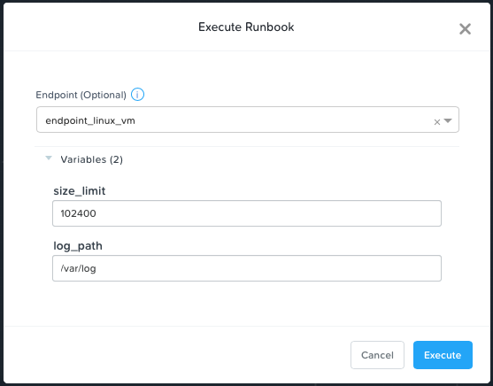

.. Adding labels to the beginning of your lab is helpful for linking to the lab from other pages
.. _runbooks:

-------------
Runbooks
-------------

Overview
++++++++

This Lab will show you how to create a Runbook for Linux and Windows VMs. We will create a simple Runbook that can trigger Windows Updates and a more complex Runbook for the Linux Endpoints which includes the decision making process.

Get Started
++++++++++++++++++++++

Open \https://<*NUTANIX-CLUSTER-IP*>:9440 in your browser to access Prism. Log in as the admin HPOC user.

Click |hamburger_menu| **> Services > Calm >** |endpoints_menu|

Here you can see the endpoints we create in the previous exercise, we will be using both of them for our Runbooks.

Create Runbook for Windows VMs
++++++++++++++++++++++

Create Runbook for Linux VMs
+++++++++++++++++++++

Click |runbooks_menu| > *+ Create Runbook*

Fill out the following fields:

  - **Name** - log_cleaner
  - **Description** - Cleanup logs for Linux VMs
  - **Project** - default
  - **Endpoint** - endpoint_linux_vm

Click **Proceed** and **Configuration** on the top middle of the window

Here we need to add two Variables which will be used in the Runbook. Click on **Add/Edit Variables** > **+ Add Variable**.

  - **Name** - log_path
  - **Data Type** - String
  - **Value** - /var/log
  - **Show Additional Options** - Tick **Mark this variable mandatory**

Click **+Add Variable** to add the second Variable.

  - **Name** - size_limit
  - **Data Type** - Integer
  - **Value** - 102400

Click the |runtime| to make sure both Variables can be edited when the Runbook is being executed.

.. |runtime| image:: images/runtime.png

.. image:: images/variables.png

Click **Done**.

Click **Editor** in the top middle and **+ Add Task**

.. note::
  This is where we can create the workflow for the Runbook. Each Task is ran individually. It is possible for execute type Tasks to run against endpoint with multiple IPs, Decision Tasks currently can only run agains single IP endpoints though, this is because each task is ran individually against the endpoint, for multiple IP endpoints we could end up with decisions that include true as well as false.

Update the first Task as following:

  - **Task Name** - CheckDir
  - **Type** - Decision
  - **Script Type** - Shell
  - **Script** - cd @@{log_path}@@

Under **False** click **Add Task** and configure it:

  - **Task Name** - CheckDir_False
  - **Type** - Execute
  - **Script Type** - EScript
  - **Script** - print "Given Logs Directory doesn't exists"

Under **True** click **Add Task** and configure it:

  - **Task Name** - CheckDir_True
  - **Type** - Set Variable
  - **Script Type** - Shell
  - **Script** - echo "size_before_cleanup="$(sudo du -d 0 @@{log_path}@@ | awk  "{print $1}")
  - **Output** - size_before_cleanup

Click **Add Task** and configure it:

  - **Task Name** - Cleanup
  - **Type** - Execute
  - **Script Type** - Shell
  - **Script**

.. code-block:: bash
   :linenos:

   #!/bin/bash
   if [[ $(sudo du -d 0 @@{log_path}@@ | awk  '{print $1}') -gt @@{size_limit}@@ ]]; then
    echo "INFO: Log size is more than expected. Clearing up old logs..."
    sudo rm -f @@{log_path}@@/*\.log\.*
   fi

Click **Add Task** and configure it:

  - **Task Name** - StoreLogsSizeAfterCleanup
  - **Type** - Set Variable
  - **Script Type** - Shell
  - **Script** - echo "size_after_cleanup="$(sudo du -d 0 @@{log_path}@@ | awk  "{print $1}")
  - **Output** - size_after_cleanup

Click **Add Task** and configure it:

  - **Task Name** - FinalOutput
  - **Type** - Execute
  - **Script Type** - EScript
  - **Script** - print 'logs size changed from @@{size_before_cleanup}@@ => @@{size_after_cleanup}@@'

Click **Save** in the top right.

Click **Execute** and select the following:

Takeaways
+++++++++

- Here is where we summarize any key takeaways from the module
- Such as how a Nutanix feature used in the lab delivers value
